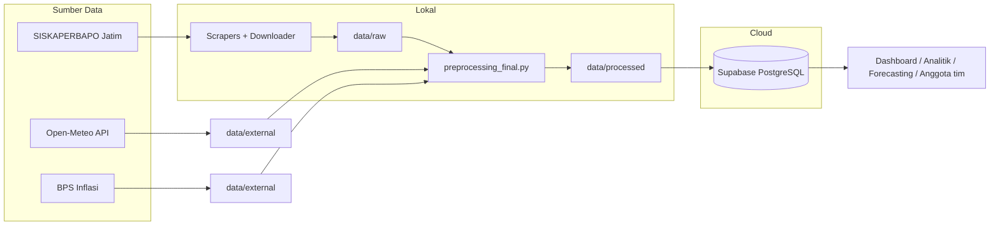

# HargaWatch — Surabaya Food Price Intelligence & Early Warning


Platform intelijen harga pangan dan peringatan dini Kota Surabaya. Pipeline data
end-to-end yang mengubah data harga pasar tradisional menjadi dataset analitik siap
pakai: harga harian per pasar, perbandingan antar pasar, tren, volatilitas, margin
produsen–konsumen, hingga dasar forecasting dan early warning.

---

## ✨ Fitur

| Fitur | Keterangan |
|---|---|
| 🏪 **Harga harian 6 pasar** | Tambahrejo, Wonokromo, Genteng, Pucang Anom, Keputran, Soponyono |
| 🥬 **37 komoditas pangan** | Beras, gula, minyak, daging, telur, cabai, bawang, sayur, ikan, dst. |
| 📈 **Sejarah panjang** | Januari 2020 — hari ini (±2.435 hari × 37 komoditas × 6 pasar) |
| ⚖️ **Dual-price column** | `harga_asli` (murni lapangan) vs `harga_imputasi` (kontinu, transparan via flag) |
| 📅 **Kalender event** | Libur nasional, cuti bersama, Ramadan & pra-Ramadan, weekend |
| 🌦 **Variabel eksternal** | Cuaca (Open-Meteo), inflasi (BPS), harga produsen |
| 🔄 **Update otomatis** | Cron harian — tanpa intervensi manual |

## 🏗 Arsitektur Pipeline



**Prinsip kualitas data** (hasil audit sains data):
- `harga_asli` — nilai murni lapangan; hari tanpa entri = `NULL` (0 dibuang)
- `harga_imputasi` — deret kontinu untuk grafik/model; gap ditambal *forward-fill murni*
  (tanpa interpolasi → **tidak ada lookahead bias**), dibulatkan ke rupiah
- `is_imputed` — transparansi penuh: setiap nilai estimasi tertanda
- Foreign key + composite primary key — integritas relasional dijaga database

## 🗃 Dataset (Silver Layer)

| Tabel | Baris | Isi |
|---|---:|---|
| `dim_pasar` | 6 | Master pasar + koordinat (lat/lon) |
| `dim_komoditas` | 37 | Master komoditas + grup + satuan |
| `dim_kalender` | 2.439 | Kalender + libur + Ramadan (2020–2026) |
| `fact_harga_pasar` | 477.097 | ⭐ Harga harian konsumen per pasar × komoditas |
| `fact_harga_produsen` | 4.872 | Harga produsen (PS Bendul Mrisi, RPH Pegirikan) |

## 🚀 Menjalankan Pipeline

```bash
pip install -r requirements.txt

# 1. Scrape harga konsumen (6 pasar) & produsen — resume otomatis
python scripts/scrape_data.py
python scripts/scrape_produsen.py

# 2. Cuaca historis (Open-Meteo, tanpa key)
python scripts/download_cuaca.py

# 3. Raw → silver layer (validasi, dual-price, kalender, trimming)
python scripts/preprocessing_final.py

# 4. Muat / sinkron ke Supabase (butuh .env — lihat .env.example)
python scripts/ingest_supabase.py

# 5. Isi tanggal yang bolong saja (idempotent, aman diulang)
python scripts/update_catchup.py
```

## ⏰ Otomatisasi Harian

Jadwal **harian 07:00** di Task Scheduler Windows (dipasang sekali):

```powershell
schtasks /Create /TN "HargaWatch Update Harian" /TR "C:\CODING~1\Project\HARGAW~1\scripts\update_catchup_task.cmd" /SC DAILY /ST 07:00 /F
```

Script `update_catchup.py` akan mendeteksi sendiri tanggal yang bolong (jendela 30 hari)
lalu mengisinya — laptop mati beberapa hari pun begitu nyala, data mengejar sendiri.
Log: `logs/catchup.log`.

> Catatan: cron via GitHub Actions sempat diuji, tetapi Cloudflare memblokir IP
> datacenter runner (403) — cron dipindah ke Task Scheduler lokal.

## 📁 Struktur Proyek

```
├── data/
│   ├── external/           # koordinat pasar, inflasi BPS, cuaca (lokal)
│   ├── raw/                # hasil scrape mentah (di-gitignore, regenerable)
│   └── processed/          # silver layer: dim_* & fact_* (di-gitignore)
├── notebook/
│   ├── eda_pasar.ipynb             # EDA data mentah pasar
│   ├── eda_produsen.ipynb          # EDA data mentah produsen
│   ├── eda_silver.ipynb            # EDA data bersih + margin + efek Ramadan
│   └── preprocessing_final.ipynb   # pipeline + verifikasi audit
├── scripts/
│   ├── scrape_data.py          # scraper harga konsumen (endpoint AJAX internal)
│   ├── scrape_produsen.py      # scraper harga produsen
│   ├── download_cuaca.py       # unduh cuaca historis (Open-Meteo)
│   ├── tambah_kalender.py      # enrich kalender ke CSV pasar
│   ├── preprocessing_final.py  # raw → silver layer (6 temuan audit terpecahkan)
│   ├── ingest_supabase.py      # DDL + muat data + verifikasi
│   ├── update_harian.py        # upsert 1 tanggal (dipakai sebagai library)
│   ├── update_catchup.py       # isi tanggal bolong (cron harian)
│   └── update_catchup_task.cmd # wrapper Task Scheduler
└── .env.example            # template kredensial Supabase
```

## 🗺 Roadmap

- [x] Scrape → validasi → cleaning → silver layer → database
- [x] Update otomatis harian + self-healing catch-up
- [x] EDA lengkap (tren, volatilitas, margin, pola Ramadan)
- [ ] `fact_cuaca` & `fact_inflasi` di database (data sudah ada)
- [ ] Forecasting 7–14 hari + baseline comparison
- [ ] Aturan early warning transparan (Normal – Waspada – Tinggi)
- [ ] Dashboard publik + Government/Analyst View

## 🤝 Konsumen Data

Anggota tim mengakses database lewat REST API Supabase (publishable key) — panduan
lengkap berisi skema, aturan query, dan contoh kode tersedia dari pengelola.
Kredensial & kunci sensitif tidak pernah masuk repositori (lihat `.gitignore`).

## 📌 Sumber Data & Atribusi

- **Harga**: [SISKAPERBAPO](https://siskaperbapo.jatimprov.go.id) — Disperindag Jawa Timur
- **Cuaca**: [Open-Meteo](https://open-meteo.com) (ERA5 reanalysis)
- **Inflasi**: [BPS](https://www.bps.go.id) — Badan Pusat Statistik
- **Kalender**: pustaka [`holidays`](https://pypi.org/project/holidays/) + SKB 3 Menteri (Ramadan)
