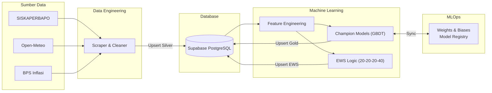

# HargaWatch - Surabaya Food Price Intelligence & Early Warning

[](https://www.python.org/)
[](https://supabase.com/)
[](https://siskaperbapo.jatimprov.go.id)
[](run_pipeline.bat)

Platform intelijen harga pangan dan peringatan dini Kota Surabaya. Pipeline data end-to-end yang mengubah data harga pasar tradisional menjadi dataset analitik siap pakai: harga harian per pasar, perbandingan antar pasar, tren, volatilitas, margin produsen-konsumen, hingga dasar forecasting dan early warning.

---

## Fitur Utama

| Fitur | Keterangan |
|---|---|
| **Harga harian 6 pasar** | Tambahrejo, Wonokromo, Genteng, Pucang Anom, Keputran, Soponyono |
| **37 komoditas pangan** | Beras, gula, minyak, daging, telur, cabai, bawang, sayur, ikan, dst. |
| **Sejarah panjang** | Januari 2020 - hari ini (~2.435 hari x 37 komoditas x 6 pasar) |
| **Dual-price column** | `harga_asli` (murni lapangan) vs `harga_imputasi` (kontinu, transparan via flag) |
| **Kalender event** | Libur nasional, cuti bersama, Ramadan & pra-Ramadan, weekend |
| **Variabel eksternal** | Cuaca (Open-Meteo), inflasi (BPS), harga produsen |
| **Update otomatis** | Cron harian (Windows Task Scheduler) tanpa intervensi manual |

## Arsitektur Pipeline (Cookiecutter Data Science & MLOps)

Proyek ini menggunakan arsitektur modular standar dengan pipeline ML otomatis.


```mermaid
flowchart LR
    subgraph Sumber Data
        A[SISKAPERBAPO]
        C[Open-Meteo]
        E[BPS Inflasi]
    end
    subgraph Pipeline [Data Engineering]
        B[Scraper & Cleaner]
    end
    subgraph ML & Analytics [Machine Learning]
        M1[Feature Engineering]
        M2["Champion Models (GBDT)"]
        M3["EWS Logic (20-20-20-40)"]
    end
    subgraph MLOps
        W["Weights & Biases<br>Model Registry"]
    end
    subgraph Database
        H[(Supabase PostgreSQL)]
    end
    A --> B
    C --> B
    E --> B
    B -->|Upsert Silver| H
    H --> M1
    M1 --> M2
    M1 --> M3
    M2 <-->|Sync| W
    M2 -->|Upsert Gold| H
    M3 -->|Upsert EWS| H
```

## Dataset

**Silver Layer (Data Mentah Bersih):**
| Tabel | Isi |
|---|---|
| `dim_pasar` | Master pasar + koordinat (lat/lon) |
| `dim_komoditas` | Master komoditas + grup + satuan |
| `dim_kalender` | Kalender + libur + Ramadan (2020–2026) |
| `fact_harga_pasar` | Harga harian konsumen per pasar × komoditas |
| `fact_harga_produsen` | Harga produsen (PS Bendul Mrisi, RPH Pegirikan) |
| `fact_cuaca` | Cuaca harian Surabaya (Open-Meteo) |

**Gold Layer (Hasil AI/ML):**
| Tabel | Isi |
|---|---|
| `fact_forecast` | Prediksi harga 7-14 hari ke depan (p10, p50, p90) |
| `fact_early_warning` | Skor matriks risiko & status (NORMAL/WASPADA/TINGGI) |

## Deployment (Otomatisasi Harian)

Sistem ini didesain untuk berjalan otomatis secara On-Premise via Windows Task Scheduler. (Menghindari *blocker* dari Cloudflare WAF).

1. **Instalasi:**
```bash
python -m venv .venv
.\.venv\Scripts\pip install -r requirements.txt
# Jangan lupa isi .env dengan kredensial Supabase & W&B (lihat .env.example)
```

2. **Eksekusi Harian:**
Cukup jalankan file batch berikut, atau atur di Windows Task Scheduler agar berjalan otomatis setiap pagi (misal 06:00 AM):
```cmd
run_pipeline.bat
```
Script ini akan otomatis mengorkestrasi *scraping* (`scripts/update_harian.py`) lalu *forecasting* (`scripts/run_forecasting.py --from-db`), dan menyimpan log ke folder `logs/`.
