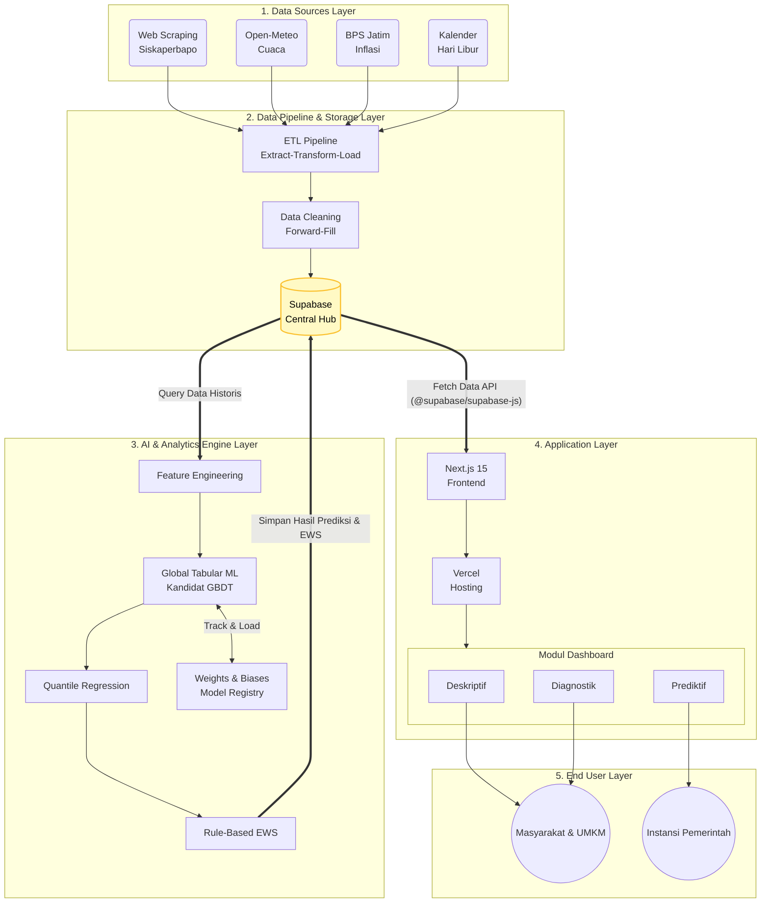

# Arsitektur Sistem HargaWatch Surabaya

Dokumen ini memetakan aliran data (*data flow*) dan batasan tanggung jawab (*separation of concerns*) untuk setiap peran dalam proyek HargaWatch.

## Diagram Arsitektur (5-Layer Hub-and-Spoke)



## Pembagian Tanggung Jawab (Separation of Concerns)

1. **Famos (Data Engineer):** Mengelola ekstraksi data dari sumber eksternal, membersihkan data yang kotor, dan menyimpannya ke tabel *Silver Layer* (`fact_harga_pasar`).
2. **Arfi (Data Scientist / ML Engineer):** Murni membaca data historis dari *Silver Layer*, menjalankan komputasi *Forecasting* dan *Anomaly Detection*, lalu menyimpan hasilnya kembali ke *Gold Layer* (`fact_forecast`, `fact_early_warning`).
3. **Kayla (Data Analyst / Frontend Developer):** Merakit UI web menggunakan **Next.js** dan mengambil data (*read-only*) dari Supabase untuk visualisasi yang interaktif.

## Database Schema (Core Tables)

### Silver Layer
- `dim_pasar`: Data master 6 pasar (id, nama, lokasi).
- `dim_komoditas`: Data master 37 komoditas (id, nama, satuan).
- `dim_kalender`: Data dimensi waktu, libur nasional, dan bulan Ramadan.
- `fact_harga_pasar`: Tabel harga harian (observasi aktual harga_asli dan harga_imputasi).
- `fact_harga_produsen`: Tabel harga historis dari tingkat produsen.
- `fact_cuaca`: Data historis cuaca harian Surabaya (suhu, curah hujan) dari Open-Meteo.
- `fact_inflasi`: Data riwayat inflasi bulanan Kota Surabaya dari BPS.

### Gold Layer (ML Targets)
- `fact_forecast`: Menyimpan hasil ramalan harga jangka pendek (7-14 hari ke depan). Memiliki batas bawah, batas tengah, dan batas atas.
- `fact_early_warning`: Menyimpan status anomali harga komposit (NORMAL, WASPADA, TINGGI).

## Struktur Direktori Proyek

```text
hargawatch-surabaya/
│
├── data/                           # 📂 Penyimpanan data lokal (diabaikan git)
│   ├── raw/                        # Data mentah dari API / scraping SISKAPERBAPO
│   ├── processed/                  # Data bersih & terstandardisasi (Silver Layer lokal)
│   └── external/                   # Data pendukung (cuaca, inflasi, kalender)
│
├── models/                         # 🤖 Artefak model ML yang sudah dilatih (.pkl / .pt)
│   ├── forecasting/                # Model prediksi time-series
│   └── anomaly_detection/          # Model deteksi anomali harga
│
├── notebook/                       # 🧪 Eksplorasi & eksperimen per komoditas (Jupyter Notebook)
│
├── src/                            # 💻 KODE INTI (Modul Python yang dapat diimpor)
│   ├── pipeline/                   # Data Pipeline: scraping, download, preprocessing
│   │   ├── scrape_data.py          # Scraper harga konsumen dari SISKAPERBAPO
│   │   ├── scrape_produsen.py      # Scraper harga produsen
│   │   ├── download_cuaca.py       # Pengambil data cuaca dari Open-Meteo
│   │   ├── download_inflasi_bps.py # Pengambil data inflasi dari BPS
│   │   ├── preprocessing_final.py  # Pembersih & normalizer data
│   │   ├── fetcher.py              # [Placeholder] API client dengan retry/timeout
│   │   └── cleaner.py              # [Placeholder] Penanganan missing values (ffill)
│   │
│   ├── analytics/                  # Logika Analitik & Feature Engineering
│   │   ├── features.py             # Feature engineering untuk time-series forecasting
│   │   ├── metrics.py              # Error Analysis Toolkit (WAPE, PICP, Residual Diagnostics)
│   │   └── seasonal.py             # [Placeholder] Analisis pola Ramadan/Nataru
│   │
│   ├── models/                     # Logika Pemodelan Machine Learning
│   │   ├── models.py               # Kumpulan Kandidat Model (GBDT, Ridge, dll)
│   │   ├── backtest.py             # Walk-forward rolling-origin backtesting engine
│   │   ├── forecast_engine.py      # Orkestrator eksperimen komparasi & ablasi di Notebook
│   │   └── anomaly_detector.py     # [Placeholder] Deteksi lonjakan harga tidak wajar
│   │
│   ├── safety/                     # Sistem Peringatan Dini (Early Warning System)
│   │   ├── early_warning.py        # Composite scoring: Normal / Waspada / Tinggi
│   │   └── alert_generator.py      # [Placeholder] Pembuat teks otomatis Price Surge Alert
│   │
│   └── utils/                      # Fungsi Pembantu Umum
│       ├── ingest_supabase.py      # Koneksi & DDL Supabase PostgreSQL
│       ├── setup_ml_tables.py      # Setup tabel Gold Layer (fact_forecast, fact_early_warning)
│       ├── tambah_kalender.py      # Generator dim_kalender (libur, Ramadan)
│       ├── utils_alerting.py       # Kirim notifikasi Telegram
│       └── logger.py               # [Placeholder] Logging sistem untuk monitoring
│
├── scripts/                        # ⚙️ Entry Points / Eksekutor (Runner Scripts)
│   ├── update_harian.py            # Cron job harian: scrape + upsert ke Supabase
│   ├── update_catchup.py           # Isi tanggal bolong di database secara otomatis
│   ├── run_forecasting.py          # Pipeline forecasting & early warning
│   ├── run_wandb_experiment.py     # Tracker eksperimen ML ke Weights & Biases
│   ├── run_pipeline.sh             # Runner bash untuk Linux VPS / Cron
│   └── generate_daily_alerts.py    # [Placeholder] Evaluasi risiko & update peringatan dini
│
├── config/                         # 🛠️ Konfigurasi Sistem
│   ├── config.yaml                 # [Placeholder] Konfigurasi database & threshold
│   └── commodities.json            # [Placeholder] Pemetaan nama komoditas/pasar
│
├── tests/                          # 🧪 Pengujian Otomatis (Pytest)
│   ├── conftest.py                 # Fixtures & data sintetis untuk pengujian
│   ├── test_alerting.py            # Uji notifikasi Telegram
│   ├── test_data_quality.py        # Uji kualitas data (ffill, outlier)
│   ├── test_early_warning.py       # Uji logika status Normal/Waspada/Tinggi
│   ├── test_ml_features.py         # Uji feature engineering (zero lookahead bias)
│   ├── test_ml_models.py           # Uji model forecasting (baseline & LightGBM)
│   └── test_pipeline_integration.py # Uji koneksi Supabase & skema tabel
│
├── web/                            # 🌐 Frontend Dashboard (Next.js 15 + Tailwind CSS v4)
│   └── src/
│       ├── app/                    # Halaman: /, /early-warning, /forecasting, /peta
│       ├── components/             # UI: SmartShoppingBasket, PriceTrendChart, dll
│       ├── data/                   # Mock data untuk pengembangan
│       └── lib/                    # Supabase client (supabase.ts)
│
├── docs/                           # 📖 Dokumentasi Proyek
│   ├── ARCHITECTURE.md             # (File ini) Peta arsitektur & struktur direktori
│   ├── PRD_HargaWatch.md           # Product Requirements Document
│   └── Evaluasi_Struktur_Proyek.md # Catatan evaluasi sebelum restrukturisasi
│
├── PROJECT_RULES.md                # Aturan koding ketat untuk AI Agent
├── ROADMAP.md                      # Status proyek & backlog mendesak
├── requirements.txt                # Semua dependensi (backward compatibility)
├── requirements-pipeline.txt       # Dependensi khusus data pipeline
└── requirements-ml.txt             # Dependensi khusus machine learning
```

## Strategi Deployment (On-Premise)
Data pipeline dan ML Pipeline dijalankan melalui **Windows Task Scheduler (On-Premise)** menggunakan skrip batch 
un_pipeline.bat setiap pagi hari. Keputusan on-premise (laptop/PC) diambil untuk menghindari pemblokiran *Cloudflare Web Application Firewall (WAF)* pada API Siskaperbapo Jatim jika diakses dari IP Data Center (seperti AWS, DigitalOcean, atau GitHub Actions). Dashboard Web tetap di-*hosting* publik (Vercel) dengan menarik data dari Supabase.
