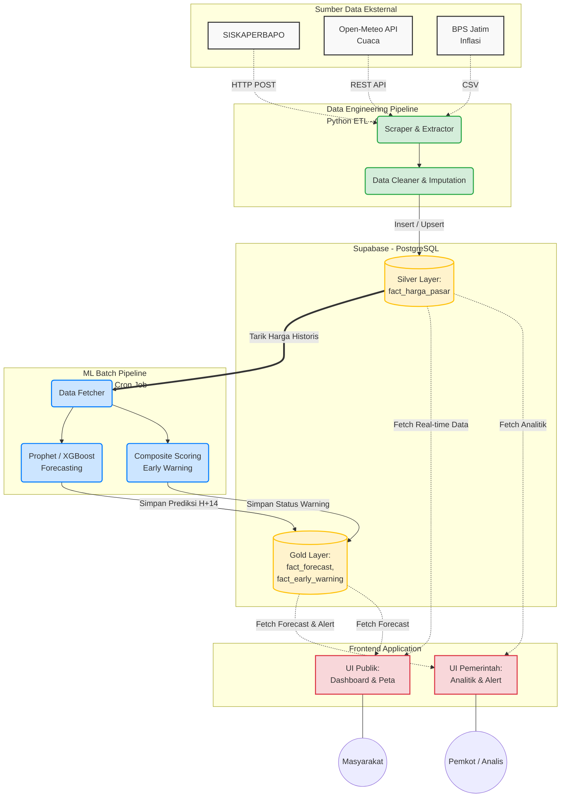

# Arsitektur Sistem HargaWatch Surabaya

Dokumen ini memetakan aliran data (*data flow*) dan batasan tanggung jawab (*separation of concerns*) untuk setiap peran dalam proyek HargaWatch.

## Diagram Arsitektur

## Pembagian Tanggung Jawab (Separation of Concerns)

Berdasarkan arsitektur di atas, proyek ini menggunakan pendekatan **Decoupled Architecture** (tidak saling mengunci). Jika salah satu komponen mati, komponen lain tetap hidup.

### 1. 🟢 Famos (Data Engineer)
- **Fokus:** Mengelola blok hijau (`Data Engineering Pipeline`).
- **Tugas:** Menulis skrip ekstraksi data dari sumber-sumber eksternal, membersihkan data yang kotor, dan memastikannya tersimpan ke tabel *Silver Layer* (`fact_harga_pasar`) di Supabase setiap hari.

### 2. 🔵 Arfi (Data Scientist / ML Engineer)
- **Fokus:** Mengelola blok biru (`ML Batch Pipeline`).
- **Tugas:** Anda **tidak perlu peduli** bagaimana Famos mendapatkan data, dan Anda **tidak perlu peduli** bagaimana Kayla menampilkan data Anda. Tugas Anda murni membaca data historis dari *Silver Layer*, menjalankan komputasi *Forecasting* dan *Anomaly Detection*, lalu menyimpan hasilnya kembali ke *Gold Layer* (`fact_forecast`).

### 3. 🔴 Kayla (Data Analyst / Frontend Developer)
- **Fokus:** Mengelola blok merah (`Frontend Application`).
- **Tugas:** Merakit UI web menggunakan **Next.js** dan mengambil data (*query*) secara aman dari Supabase menggunakan API bawaan Supabase (`@supabase/ssr`). Kayla tidak perlu menjalankan perhitungan ML atau parsing HTML yang berat, cukup fokus pada visualisasi yang mulus untuk pengguna.
