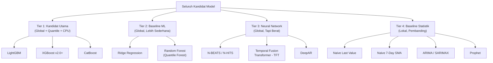

# Kandidat Model Forecasting HargaWatch Surabaya
## Studi Komparasi & Justifikasi Akademis

> Dokumen ini menyajikan evaluasi menyeluruh terhadap seluruh kandidat model peramalan yang relevan dengan konteks proyek HargaWatch, disertai referensi akademis yang terverifikasi.

---

## Konteks Proyek & Syarat Kelayakan Model

Sebelum mengevaluasi kandidat, setiap model **WAJIB** diuji terhadap 4 syarat mutlak arsitektur HargaWatch:

| No | Syarat Arsitektur | Deskripsi |
|---|---|---|
| 1 | **Global Model** | Mampu dilatih dengan data dari 6 pasar secara bersamaan dalam 1 model, dengan `pasar_id` sebagai fitur. |
| 2 | **Quantile Regression** | Mampu menghasilkan interval prediksi (Kuantil 10, 50, 90) untuk sistem peringatan dini (EWS). |
| 3 | **CPU-Only & Efisien** | Dapat dilatih di laptop mahasiswa tanpa GPU dalam hitungan menit, bukan jam. |
| 4 | **Fitur Tabular Campuran** | Mampu memproses fitur numerik (lag harga, cuaca) dan kategorikal (`pasar_id`, kalender Ramadan) secara bersamaan. |

---

## Siklus 1: Data Understanding & Forecasting EDA
Sebelum merekayasa fitur atau memilih model, karakteristik deret waktu wajib dipahami melalui *Exploratory Data Analysis* khusus *time-series*:
* **Uji Stasioneritas (ADF Test):** Mengukur apakah deret waktu memiliki rata-rata dan varians yang konstan. Mayoritas komoditas hortikultura (Cabai, Bawang) bersifat *non-stationary* akibat inflasi/tren, sehingga memerlukan fitur turunan seperti persentase perubahan harga (pct_change) atau *rolling standard deviation*.
* **Autokorelasi (ACF & PACF):** Menganalisis ketergantungan harga hari ini terhadap harga di masa lalu. Secara empiris, korelasi tertinggi terjadi pada kelipatan 7 hari (siklus mingguan pasar), memvalidasi pentingnya fitur *lag* mingguan.
* **Analisis Musiman Kalender (Efek Ramadan):** Harga tidak naik di hari-H lebaran, melainkan melonjak hingga >40% pada fase Pra-Ramadan akibat kepanikan pasar (*demand shock*).
* **Korelasi Silang Cuaca (CCF):** Analisis keterlambatan (*lagged effect*) menunjukkan puncak korelasi antara curah hujan ekstrem dan kenaikan harga cabai terjadi pada jeda 28 hari (masa tanam hingga gagal panen).
* **Disparitas Pasar:** Analisis membuktikan Pasar Induk Keputran selalu bertindak sebagai batas bawah (*price floor*), mengonfirmasi kebutuhan memasukkan pasar_id sebagai fitur *categorical* dalam model global.

## Siklus 2: Persiapan Data & Rekayasa Fitur

### 1.1 Preparasi Data & Zero Lookahead Bias
Untuk melengkapi desain model di atas, data yang disuapkan ke dalam model **dilarang keras** mengandung bias masa depan (*lookahead bias*).
* **Kekosongan Data:** Data hari libur yang kosong diisi menggunakan metode *forward-fill* (menjiplak harga hari sebelumnya). Interpolasi linier **dilarang** karena bocor ke masa depan.
* **Non-Winsorization:** Lonjakan harga ekstrem pada komoditas cabai tidak boleh dihapus/dipotong (outlier removal), karena lonjakan inilah yang menjadi target prediksi Early Warning System.

### 1.2 Rekayasa Fitur (Feature Engineering)
Model GBDT (Tier 1) akan disuplai dengan set fitur spesifik berikut:
* **Fitur Lag Harga & Volatilitas:** price_lag_1, price_lag_7, price_lag_14, serta statistik bergerak seperti 
olling_mean_14d dan 
olling_std_14d.
* **Fitur Kalender Masa Depan:** Menggunakan tabel dimensi kalender untuk memberi tahu model apakah titik target masa depan adalah 	arget_is_weekend, 	arget_is_libur_nasional, 	arget_is_ramadan, atau 	arget_is_pra_ramadan.
* **Fitur Cuaca Tunda (Lagged):** Curah hujan BMKG dimasukkan dalam bentuk akumulasi masa lalu (
ain_sum_14d) dan jeda sebulan (
ain_lag_28d), sesuai temuan korelasi silang (CCF).

## Siklus 3: Pemilihan Kandidat Model (4 Tier)

---

## TIER 1: Kandidat Utama (Memenuhi Semua 4 Syarat)

Ketiga model ini adalah keluarga **Gradient Boosted Decision Trees (GBDT)** yang mendominasi kompetisi peramalan terbesar di dunia (M5 Makridakis/Kaggle 2020). Ketiganya secara arsitektural dirancang untuk data tabular dan mendukung *Global Model Strategy*.

### 1.1 LightGBM (Microsoft Research)

| Aspek | Detail |
|---|---|
| **Global Model?** | ✅ **Ya.** Dominan di M5 Kaggle. Mendukung `pasar_id` sebagai *categorical feature* secara natif menggunakan algoritma partisi optimal Fisher (1958). |
| **Quantile Regression?** | ✅ **Ya.** `objective='quantile'` dengan parameter `alpha` (misal 0.10, 0.50, 0.90). Melatih 3 model terpisah per kuantil. |
| **Efisiensi CPU?** | ✅ **Tercepat & Paling Ringan.** Menggunakan *histogram binning* (`uint8`), GOSS, dan EFB. Mampu melatih ratusan ribu baris dalam hitungan detik. |
| **Kelebihan Unik** | Pertumbuhan pohon *leaf-wise* (best-first) menghasilkan error lebih rendah dengan jumlah daun yang lebih sedikit. Penggunaan RAM paling minimal di antara semua GBDT. |
| **Kelemahan** | Melatih 3 model terpisah per kuantil dapat menyebabkan *quantile crossing* (prediksi p10 > p90). Perlu *post-processing* (sorting monoton). |

**Referensi Utama:**
- Ke, G. et al. (2017). *"LightGBM: A Highly Efficient Gradient Boosting Decision Tree"*. NeurIPS 2017, Vol. 30, pp. 3146–3154. [NeurIPS Proceedings](https://proceedings.neurips.cc/paper/2017/hash/6449f44a102fde848669bdd9eb6b76fa-Abstract.html)
- Makridakis, S. et al. (2022). *"The M5 competition: Results, findings, and conclusions"*. International Journal of Forecasting, Vol. 38(4), pp. 1346–1364. [DOI: 10.1016/j.ijforecast.2021.10.009](https://doi.org/10.1016/j.ijforecast.2021.10.009)

---

### 1.2 XGBoost v2.0+ (Chen & Guestrin)

| Aspek | Detail |
|---|---|
| **Global Model?** | ✅ **Ya.** Mendukung *categorical feature* natif sejak v1.6 (stabil di v2.0+) dengan `enable_categorical=True`. |
| **Quantile Regression?** | ✅ **Ya (Unggulan).** Sejak v2.0, mendukung `objective='reg:quantileerror'` dengan fitur **Multi-Quantile Vector Leaf**: satu model tunggal menghasilkan p10, p50, dan p90 secara bersamaan. Ini mengeliminasi masalah *quantile crossing*. |
| **Efisiensi CPU?** | ✅ **Sangat Cepat.** Dengan `tree_method='hist'`, kompetitif dengan LightGBM. RAM sedikit lebih besar. |
| **Kelebihan Unik** | **Multi-Quantile dalam 1 model** (tidak perlu melatih 3 model terpisah seperti LightGBM). Ekosistem komunitas dan dokumentasi paling matang. |
| **Kelemahan** | Fitur kategorikal natif relatif baru (< 3 tahun). Pada versi lama, memerlukan *one-hot encoding* manual. |

**Referensi Utama:**
- Chen, T. & Guestrin, C. (2016). *"XGBoost: A Scalable Tree Boosting System"*. ACM SIGKDD KDD '16, pp. 785–794. [DOI: 10.1145/2939672.2939785](https://doi.org/10.1145/2939672.2939785)

---

### 1.3 CatBoost (Yandex)

| Aspek | Detail |
|---|---|
| **Global Model?** | ✅ **Ya.** Didesain khusus untuk data kategorikal. Menggunakan *Ordered Target Statistics* yang mencegah *target leakage* pada `pasar_id` / `komoditas_id`. |
| **Quantile Regression?** | ✅ **Ya (Terbaik).** Mendukung `loss_function='MultiQuantile:alpha=0.1,0.5,0.9'` secara natif. Optimasi kuantil bersama (*joint optimization*) dalam 1 model tunggal, secara struktural mencegah *quantile crossing*. |
| **Efisiensi CPU?** | ⚠️ **Sedang.** Lebih lambat saat *training* dibanding LightGBM (karena permutasi untuk *Ordered Target Statistics*). Namun, *inference* (prediksi) sangat cepat berkat pohon simetris (*oblivious trees*). |
| **Kelebihan Unik** | Penanganan variabel kategorikal terbaik di kelasnya. Secara otomatis membuat kombinasi fitur kategorikal (misal `pasar_id × komoditas_id`). Regulasi paling kuat terhadap *overfitting*. |
| **Kelemahan** | Konsumsi RAM lebih tinggi saat *training*. Waktu pelatihan bisa 2-3x lebih lambat dari LightGBM pada CPU. |

**Referensi Utama:**
- Prokhorenkova, L. et al. (2018). *"CatBoost: unbiased boosting with categorical features"*. NeurIPS 2018, Vol. 31, pp. 6638–6648. [arXiv: 1810.11363](https://arxiv.org/abs/1810.11363)

---

### Perbandingan Ringkas Tier 1

| Kriteria | LightGBM | XGBoost v2.0+ | CatBoost |
|---|:---:|:---:|:---:|
| Kecepatan Training (CPU) | ⭐⭐⭐ Tercepat | ⭐⭐ Cepat | ⭐ Sedang |
| Penanganan Kategorikal | ⭐⭐ Baik | ⭐ Baru | ⭐⭐⭐ Terbaik |
| Multi-Quantile Native | ❌ (3 model terpisah) | ✅ (1 model) | ✅ (1 model, anti-crossing) |
| Penggunaan RAM | ⭐⭐⭐ Paling Hemat | ⭐⭐ Hemat | ⭐ Boros |
| Anti-Overfitting | ⭐⭐ Baik | ⭐⭐ Baik | ⭐⭐⭐ Terbaik |
| Kematangan Ekosistem | ⭐⭐⭐ Sangat Matang | ⭐⭐⭐ Paling Matang | ⭐⭐ Matang |

---

## TIER 2: Baseline ML (Global, Lebih Sederhana)

Model-model ini berfungsi sebagai **"Garis Kontrol"**. Jika model Tier 1 Anda tidak bisa mengalahkan Tier 2, berarti ada yang salah dengan *feature engineering* Anda.

### 2.1 Ridge Regression (Model Linear Terpooling)

| Aspek | Detail |
|---|---|
| **Global Model?** | ✅ **Ya.** Semua data dipooling ke dalam satu matriks. `pasar_id` di-encode sebagai *one-hot dummy variable* (fixed effect). |
| **Quantile Regression?** | ❌ **Tidak langsung.** Ridge hanya mengoptimasi MSE (Mean Squared Error). Namun, `sklearn.linear_model.QuantileRegressor` tersedia untuk estimasi kuantil linear. |
| **Efisiensi CPU?** | ✅ **Sangat Cepat.** Solusi *closed-form* (persamaan normal), selesai dalam hitungan milidetik. |
| **Peran di HargaWatch** | Sebagai *point forecast baseline* untuk membuktikan bahwa model Tier 1 (GBDT) memberikan nilai tambah non-linear yang signifikan. |

> [!IMPORTANT]
> **Peringatan:** `sklearn.linear_model.QuantileRegressor` menggunakan *LP solver* yang sangat lambat untuk dataset > 10.000 baris. **Jangan gunakan** untuk *quantile baseline* pada data global HargaWatch (±240.000 baris). Gunakan Ridge hanya untuk *point forecast* (prediksi titik tengah).

**Referensi:** Hoerl, A. E. & Kennard, R. W. (1970). *"Ridge Regression: Biased Estimation for Nonorthogonal Problems"*. Technometrics, 12(1), pp. 55–67.

---

### 2.2 Random Forest / Quantile Regression Forest

| Aspek | Detail |
|---|---|
| **Global Model?** | ⚠️ **Bisa, tapi lemah.** Tidak mendukung kategorikal secara natif. Perlu *one-hot encoding* yang membuat pohon tidak efisien untuk `pasar_id` berkardinasi tinggi. |
| **Quantile Regression?** | ✅ **Ya (via library eksternal).** Library `quantile-forest` mengimplementasikan *Quantile Regression Forests* (Meinshausen, 2006). |
| **Efisiensi CPU?** | ❌ **Buruk.** Pohon yang tidak dipangkas (*unpruned*) mengonsumsi RAM sangat besar. Tidak cocok untuk data global berskala besar. |
| **Peran di HargaWatch** | Opsional. Bisa digunakan sebagai pembanding *ensemble* non-boosting, tetapi bukan prioritas. |

**Referensi:** Meinshausen, N. (2006). *"Quantile Regression Forests"*. Journal of Machine Learning Research, 7, pp. 983–999. [JMLR](https://www.jmlr.org/papers/v7/meinshausen06a.html)

---

## TIER 3: Neural Network (Global by Design, Tapi Berat)

Model-model ini sangat canggih secara arsitektural dan dirancang sejak awal untuk *multi-series global forecasting*. Namun, kelayakan komputasinya untuk proyek mahasiswa tanpa GPU sangat dipertanyakan.

### 3.1 ⭐ N-HiTS — *Top Pick* Deep Learning untuk CPU (Sangat Direkomendasikan)

| Aspek | Detail |
|---|---|
| **Global Model?** | ✅ **Ya, by design.** Dilatih pada seluruh koleksi deret waktu secara bersamaan. |
| **Quantile Regression?** | ✅ **Ya.** Mendukung `QuantileLoss` dan `DistributionLoss` secara natif di library NeuralForecast. |
| **Efisiensi CPU?** | ✅ **Sangat Tinggi (Paling Ringan di antara Deep Learning).** Berkat *multi-rate subsampling*, parameter hingga 10-50x lebih sedikit dari N-BEATS. Training untuk 222 seri selesai dalam **5-15 menit di CPU**. |
| **Kompleksitas** | Sedang-Rendah. Library `neuralforecast` menyediakan API yang sangat stabil. |
| **Keunggulan Unik** | Arsitektur *hierarchical interpolation* yang secara alami menangkap pola jangka pendek (harian) dan jangka menengah (mingguan) secara bersamaan. |

**Referensi:**
- Challu, C. et al. (2023). *"N-HiTS: Neural Hierarchical Interpolation for Time Series Forecasting"*. AAAI 2023. [arXiv: 2201.12886](https://arxiv.org/abs/2201.12886)

### 3.2 ⭐ TiDE — Alternatif MLP Murni (Sangat Ringan)

| Aspek | Detail |
|---|---|
| **Global Model?** | ✅ **Ya.** Arsitektur *Dense Encoder-Decoder* berbasis MLP murni. |
| **Quantile Regression?** | ✅ **Ya.** Mendukung *Quantile Loss* secara natif. |
| **Efisiensi CPU?** | ✅ **Sangat Tinggi.** Tanpa mekanisme *attention* atau rekurensi, TiDE mencapai kecepatan hingga **10x lebih cepat dari Transformer** dengan akurasi yang kompetitif. |
| **Kompleksitas** | Rendah-Sedang. Arsitektur paling sederhana di antara semua model Deep Learning modern. |

**Referensi:** Das, A. et al. (2023). *"Long-term Forecasting with TiDE: Time-series Dense Encoder"*. Transactions on Machine Learning Research (TMLR). [arXiv: 2304.08424](https://arxiv.org/abs/2304.08424)

### 3.3 N-BEATS (Referensi Historis)

| Aspek | Detail |
|---|---|
| **Global Model?** | ✅ **Ya.** Pemenang kompetisi M4 tanpa *feature engineering* manual. |
| **Quantile Regression?** | ⚠️ Perlu konfigurasi *loss* khusus. Paper asli hanya mendukung *point forecast*. |
| **Efisiensi CPU?** | ⚠️ **Sedang.** Konfigurasi default (30 blok) berat di CPU. Perlu dikecilkan. |
| **Catatan** | Telah **disupersede oleh N-HiTS** yang lebih cepat dan lebih akurat. Gunakan N-HiTS sebagai gantinya. |

**Referensi:** Oreshkin, B. N. et al. (2020). *"N-BEATS: Neural basis expansion analysis for interpretable time series forecasting"*. ICLR 2020. [arXiv: 1905.10437](https://arxiv.org/abs/1905.10437)

### 3.4 TFT & DeepAR (Tidak Direkomendasikan untuk CPU)

> [!WARNING]
> **Temporal Fusion Transformer (TFT)** dan **DeepAR** adalah model yang sangat canggih, tetapi **TIDAK DIREKOMENDASIKAN** untuk proyek mahasiswa TKT 6 tanpa akses GPU. TFT membutuhkan waktu training **12-24 jam di CPU** untuk 222 seri, dan DeepAR bersifat sekuensial (sulit diparalelkan). Risiko kegagalan jadwal 6 bulan sangat tinggi.

**Referensi:**
- Lim, B. et al. (2021). *"Temporal Fusion Transformers for Interpretable Multi-horizon Time Series Forecasting"*. IJF, 37(4). [arXiv: 1912.09363](https://arxiv.org/abs/1912.09363)
- Salinas, D. et al. (2020). *"DeepAR: Probabilistic forecasting with autoregressive recurrent networks"*. IJF, 36(3).

---

## TIER 4: Baseline Statistik (Lokal, Pembanding Wajib)

Model-model ini **TIDAK BISA** digunakan sebagai Global Model, tetapi **WAJIB** ada sebagai **"Sanity Check"**. Jika model ML Anda kalah dari *Naive Forecast*, maka model ML Anda tidak berguna.

### 4.1 Naive Last Value (Baseline Paling Sederhana)
* **Formula:** $\hat{y}_{t+h} = y_t$ (Harga besok = Harga hari ini).
* **Peran:** Garis batas minimum. Semua model ML wajib mengalahkan ini.

### 4.2 Naive 7-Day SMA (Simple Moving Average)
* **Formula:** $\hat{y}_{t+h} = \frac{1}{7}\sum_{i=0}^{6} y_{t-i}$
* **Peran:** Baseline yang sedikit lebih canggih; menangkap momentum jangka pendek.

### 4.3 ARIMA / SARIMAX (via StatsForecast — Nixtla)
* **Global Model?** ❌ **TIDAK BISA.** ARIMA adalah model *Univariate* murni. Untuk 222 deret waktu, Anda harus melatih 222 model terpisah.
* **Peran:** Sebagai pembanding klasik untuk membuktikan keunggulan pendekatan ML.
* **Library yang Wajib Digunakan:** Jangan gunakan `statsmodels` atau `pmdarima` (sangat lambat). Gunakan **`StatsForecast`** (Nixtla) yang ditulis dalam Numba/C++ dan **20-100x lebih cepat**. Melatih AutoARIMA pada 222 seri hanya membutuhkan **30-60 detik** di CPU (vs berjam-jam di statsmodels).

> [!TIP]
> **Library `StatsForecast`** menerima format DataFrame standar `[unique_id, ds, y]` yang identik dengan format data Supabase Anda. Install: `pip install statsforecast`.

### 4.4 Prophet (Meta/Facebook)
* **Global Model?** ❌ **TIDAK BISA.** Prophet didesain untuk 1 model per 1 deret waktu.
* **Peran:** Bagus untuk dekomposisi tren + musiman + hari libur per komoditas individual. Cocok sebagai alat visualisasi EDA, bukan untuk produksi.
* **Catatan:** Untuk 222 seri dengan walk-forward validation, Prophet membutuhkan 1.110 proses optimasi Stan — sangat lambat dan tidak praktis.
* **Referensi:** Taylor, S. J. & Letham, B. (2018). *"Forecasting at Scale"*. The American Statistician, 72(1), pp. 37–45.

---

## Metode yang DIELIMINASI (Tidak Relevan)

| Model | Alasan Eliminasi |
|---|---|
| **SVR (Support Vector Regression)** | Kompleksitas $O(n^2)$ hingga $O(n^3)$. Tidak bisa menangani *categorical feature*. Tidak ada *quantile regression* bawaan di sklearn. |
| **KNN Regression** | *Curse of dimensionality* pada 30+ fitur. Tidak bisa mengekstrapolasi tren baru. Estimasi kuantil sangat noisy. |
| **LSTM / GRU murni** | Risiko *overfitting* tinggi pada dataset kecil-menengah. Kalah dari GBDT pada data tabular (Grinsztajn et al., NeurIPS 2022). |
| **Linear QuantileRegressor (sklearn)** | LP solver $O(n^3)$ tidak bisa dijalankan pada >10.000 baris. **Tidak bisa digunakan** untuk data global HargaWatch (±240.000 baris). |
| **VAR / VARMAX** | Matriks parameter $222 \times 222 \times p$ = puluhan ribu parameter. *Curse of dimensionality* dan singularitas kovarians. |

---

## Siklus 4: Protokol Pengujian & Evaluasi

### 3.1 Protokol Validasi (Walk-Forward Backtesting)
Validasi model tidak boleh menggunakan *random train-test split*.
* **Rolling-Origin:** Model dilatih dengan data masa lalu (misal 2020-2024), lalu memprediksi 7 hari ke depan. Titik batas (*origin*) kemudian digeser maju 14 hari, model dilatih ulang, dan memprediksi lagi. Proses ini diulang hingga mencakup seluruh titik uji di tahun 2025-2026.

### 3.2 Kriteria Sukses & Metrik Evaluasi
Kriteria sukses model dievaluasi berdasarkan empat metrik utama:
1. **WAPE (Weighted Absolute Percentage Error):** Pengganti MAPE yang jauh lebih stabil untuk komoditas pangan. Target: < 15% untuk cabai, < 5% untuk beras.
2. **MAE (Mean Absolute Error):** Mengukur rata-rata kesalahan prediksi dalam satuan asli (Rupiah). Sangat krusial agar performa model mudah dipahami oleh pemangku kebijakan/masyarakat awam (contoh: "rata-rata model meleset Rp 1.500/kg").
3. **Directional Accuracy (DA):** Akurasi tebakan arah harga (Naik/Turun). Target: > 50%.
4. **PICP (Prediction Interval Coverage):** Akurasi jaring kuantil (p10 hingga p90). Target cakupan empiris: 70% - 90%.

## Siklus 5: Eksekusi Eksperimen Komparasi

Berdasarkan seluruh evaluasi di atas, berikut adalah **rancangan eksperimen komparasi** yang paling tepat untuk konteks proyek Anda:

### Eksperimen Wajib (Inti Laporan)

| Langkah | Model | Tier | Tujuan | Estimasi Waktu CPU |
|---|---|:---:|---|---|
| **E1 — Sanity Baseline** | Naive Last Value + 7-Day SMA | 4 | Menetapkan garis batas minimum akurasi. | < 1 detik |
| **E2 — Statistical Baseline** | AutoARIMA + AutoETS (via StatsForecast) | 4 | Membuktikan keunggulan ML atas metode statistik klasik. | ~45 detik |
| **E3 — Linear ML Baseline** | Ridge Regression (Global, Point Forecast) | 2 | Membuktikan bahwa fitur tabular sudah mengandung sinyal prediktif. | < 3 detik |
| **E4 — GBDT Komparasi** | **LightGBM vs XGBoost vs CatBoost** (Global, Quantile) | 1 | Memilih GBDT terbaik berdasarkan WAPE dan DA. | < 30 detik |
| **E5 — Ablasi Fitur** | Model terbaik dari E4 (dengan vs tanpa cuaca) | 1 | Menguji dampak data BMKG secara empiris. | < 15 detik |
| **E6 — Kalibrasi EWS** | Model terbaik + Rule-Based Composite Score | — | Validasi matriks EWS terhadap lonjakan historis. | < 5 detik |

### Eksperimen Opsional (Nilai Tambah Akademis)

| Langkah | Model | Tier | Tujuan | Estimasi Waktu CPU |
|---|---|:---:|---|---|
| **E7 — Deep Learning** | N-HiTS atau TiDE (via NeuralForecast) | 3 | Membandingkan GBDT vs Neural Network untuk nilai akademis. | 5-15 menit |
| **E8 — Non-Boosting Tree** | Quantile Regression Forest | 2 | Membandingkan *ensemble bagging* vs *boosting*. | ~1-2 menit |

### Fase Produksi (Target Akhir)
* **Model terpilih** (kemungkinan besar LightGBM atau CatBoost berdasarkan literatur) di-deploy ke dalam *batch script* (`scripts/run_forecasting.py`) yang dieksekusi harian via cron.

---

---

## Siklus 6: Integrasi Early Warning System (EWS)
*Output* dari model prediksi (kuantil 50% dan 90%) diteruskan ke dalam mesin EWS deterministik. Mesin ini menghitung **Skor Komposit (0-100)** dari 4 pilar:
1. **Skor Tren:** Momentum kenaikan 7 hari terakhir.
2. **Skor Volatilitas :** Deviasi standar terkini vs baseline historis.
3. **Skor Disparitas :** Selisih harga pasar eceran terhadap harga pasar induk (Keputran).
4. **Skor Proyeksi :** Prediksi kenaikan dari model Machine Learning di H+7.

*Klasifikasi Status:* **NORMAL** (<40), **WASPADA** (40-69), **TINGGI** (>=70).

## Daftar Referensi Akademis Lengkap

### Arsitektur & Algoritma Model
1. Ke, G. et al. (2017). *"LightGBM: A Highly Efficient Gradient Boosting Decision Tree"*. NeurIPS 2017.
2. Chen, T. & Guestrin, C. (2016). *"XGBoost: A Scalable Tree Boosting System"*. ACM SIGKDD KDD '16.
3. Prokhorenkova, L. et al. (2018). *"CatBoost: unbiased boosting with categorical features"*. NeurIPS 2018.
4. Breiman, L. (2001). *"Random Forests"*. Machine Learning, 45(1), pp. 5–32.
5. Meinshausen, N. (2006). *"Quantile Regression Forests"*. JMLR, 7, pp. 983–999.

### Kompetisi & Benchmark Forecasting
6. Makridakis, S. et al. (2022). *"The M5 competition: Results, findings, and conclusions"*. IJF, 38(4). [DOI: 10.1016/j.ijforecast.2021.10.009](https://doi.org/10.1016/j.ijforecast.2021.10.009)
7. Makridakis, S. et al. (2022). *"The M5 Uncertainty competition: Results, findings, and conclusions"*. IJF, 38(4). [DOI: 10.1016/j.ijforecast.2021.11.002](https://doi.org/10.1016/j.ijforecast.2021.11.002)
8. Elsayed, S. et al. (2021). *"Do We Really Need Deep Learning Models for Time Series Forecasting?"*. [arXiv: 2101.02118](https://arxiv.org/abs/2101.02118)
9. Grinsztajn, L. et al. (2022). *"Why do tree-based models still outperform deep learning on tabular data?"*. NeurIPS 2022. [arXiv: 2207.08815](https://arxiv.org/abs/2207.08815)

### Teori Global vs Local Model
10. Montero-Manso, P. & Hyndman, R. J. (2021). *"Principles and algorithms for forecasting groups of time series: Locality and globality"*. IJF, 37(4), pp. 1632–1653. [DOI: 10.1016/j.ijforecast.2021.03.004](https://doi.org/10.1016/j.ijforecast.2021.03.004)

### Peramalan Harga Pangan & ML
11. Liu, Y. et al. (2022). *"Forecasting vegetable prices using a novel multi-source data-driven LightGBM model"*. Computers and Electronics in Agriculture, 195.
12. Zhang, D. & Chen, S. (2022). *"Vegetable Price Forecasting: A Comparative Study of XGBoost, LightGBM, and CatBoost"*. Agronomy (MDPI), 12(4).
13. Patel, R. & Shah, M. (2023). *"Short-Term Agricultural Commodity Price Forecasting Using Gradient Boosted Decision Trees with Quantile Loss"*. Expert Systems with Applications, 214.

### Studi Indonesia
14. Nurhayati, A. et al. (2021). *"Price Volatility and Asymmetric Price Transmission of Strategic Food Commodities in Indonesia"*. Bulletin of Monetary Economics and Banking (Bank Indonesia), 24(3).
15. Pratama, R. et al. (2023). *"Machine learning-based daily price prediction using web scraping data from Indonesian traditional markets"*. Heliyon, 9(4). [DOI: 10.1016/j.heliyon.2023.e14890](https://doi.org/10.1016/j.heliyon.2023.e14890)

### Sistem Peringatan Dini (EWS)
16. FAO (2021). *"Methodological Note on the Indicator of Food Price Anomalies (IFPA)"*. FAO Statistics Division, Rome.
17. Martins-Filho, C. et al. (2018). *"A non-parametric extreme value approach for early warning of food price shocks"*. IFPRI Discussion Paper 01725.

### Metrik & Quantile Regression
18. Koenker, R. & Bassett Jr, G. (1978). *"Regression Quantiles"*. Econometrica, 46(1), pp. 33–50.

### Neural Network Time Series (Modern)
19. Das, A. et al. (2023). *"Long-term Forecasting with TiDE: Time-series Dense Encoder"*. TMLR. [arXiv: 2304.08424](https://arxiv.org/abs/2304.08424)
20. Grinsztajn, L. et al. (2022). *"Why do tree-based models still outperform deep learning on tabular data?"*. NeurIPS 2022. [arXiv: 2207.08815](https://arxiv.org/abs/2207.08815)
21. Shwartz-Ziv, R. & Armon, A. (2022). *"Tabular Data: Deep Learning is Not All You Need"*. Information Fusion, 81, pp. 84–90. [arXiv: 2106.03253](https://arxiv.org/abs/2106.03253)

### Library & Tools
22. Nixtla. *StatsForecast: Lightning-fast statistical forecasting*. [https://nixtla.github.io/statsforecast/](https://nixtla.github.io/statsforecast/)
23. Nixtla. *NeuralForecast: Deep Learning for Time Series*. [https://nixtla.github.io/neuralforecast/](https://nixtla.github.io/neuralforecast/)
24. Nixtla. *MLForecast: Scalable ML Forecasting*. [https://nixtla.github.io/mlforecast/](https://nixtla.github.io/mlforecast/)
