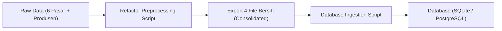

# Panduan Audit Sains Data, Tinjauan Bisnis, & Rencana Migrasi Database HargaWatch

Dokumen ini disusun sebagai panduan komprehensif untuk mengevaluasi pekerjaan data yang ada di [HargaWatch](file:///c:/Coding%20SDT/Project/HargaWatch), memastikan kepatuhan terhadap kaidah sains data, menyelaraskan dengan tujuan bisnis pemantauan harga pangan, serta menyiapkan data agar siap 100% dimigrasikan ke database.

---

## 1. Ringkasan Eksekutif

Pekerjaan yang telah Anda lakukan pada notebook [eda_pasar.ipynb](file:///c:/Coding%20SDT/Project/HargaWatch/notebook/eda_pasar.ipynb), [eda_produsen.ipynb](file:///c:/Coding%20SDT/Project/HargaWatch/notebook/eda_produsen.ipynb), [preprocessing_pasar.ipynb](file:///c:/Coding%20SDT/Project/HargaWatch/notebook/preprocessing_pasar.ipynb), dan [preprocessing_produsen.ipynb](file:///c:/Coding%20SDT/Project/HargaWatch/notebook/preprocessing_produsen.ipynb) sudah berada pada jalur yang tepat (~75% selesai). 

Pemahaman domain lokal Anda sangat kuat:
- Berhasil mengenali harga `0` sebagai representasi data kosong (*missing value* terselubung), bukan bahan pangan gratis.
- Rekonstruksi kalender kontinu harian menggunakan `pd.date_range` dan `pd.MultiIndex`.
- Membuang komoditas non-pangan (`Bata`) dan merapikan penamaan (`Halus` $\rightarrow$ `Garam Beryodium Halus`).
- Menambahkan penanda *flag* transparansi (`imputed`).

Namun, sebelum data dimigrasikan ke database produksi, terdapat **beberapa celah teknis dan struktural** yang perlu dirapikan agar database tidak menyimpan data cacat (*corrupted/leaked data*) dan siap dikonsumsi oleh aplikasi maupun model prediktif.

---

## 2. Temuan Audit Berdasarkan Kaidah Sains Data

### A. Rincian Isu Kritis

| No | Komponen | Masalah Ditemukan | Dampak Sains Data / Teknis |
|:---|:---|:---|:---|
| **1** | **Metode Imputasi** | Chained `ffill(3).interpolate(7)` diterapkan tanpa seleksi panjang gap. | Menyebabkan *lookahead bias* (interpolasi linier meminjam harga masa depan). Pada gap >10 hari, 10 hari pertama terisi semu dan sisanya tetap `NaN`. Menghasilkan angka desimal tidak wajar (misal: Rp 25.184,21). |
| **2** | **Sisa Missing Value** | Kolom target `harga` masih menyisakan `NaN` di seluruh file olahan. | Model machine learning/forecasting akan gagal eksekusi (*crash*). Query SQL agregasi akan terputus kontinuitas tanggalnya. |
| **3** | **Kelengkapan Pasar** | Pasar Genteng ada di data mentah (102.270 baris) dan dianalisis di EDA, tetapi **absen dari preprocessing**. | Kehilangan representasi pasar ritel sentral di pusat Kota Surabaya. |
| **4** | **Sinkronisasi Kolom** | Kolom `harga_kemarin` dibiarkan statis dari hasil scraper. | Terjadi desinkronisasi (65 baris di Pucang Anom bernilai `NaN` pada hari setelah imputasi). Seharusnya fitur lag dihitung dinamis. |
| **5** | **Kelengkapan Kalender** | Data produsen ([data_produsen_clean.csv](file:///c:/Coding%20SDT/Project/HargaWatch/data/processed/data_produsen_clean.csv)) tidak memiliki fitur kalender/Ramadan. | Ketidaksinkronan fitur saat menggabungkan data produsen dan data pasar konsumen. |
| **6** | **Leading NaNs** | Pembuatan grid tanggal dari `2020-01-01` menyisakan 29–34 hari kosong di awal untuk komoditas yang baru tercatat belakangan. | `ffill` dan `interpolate` gagal mengisi data awal karena tidak ada nilai dasar sebelumnya (*no historical reference*). |

---

### B. Bukti Temuan Riil pada Data Olahan

#### 1. Masih Ada Nilai `NaN` pada Target `harga`
Berdasarkan pemeriksaan aktual pada folder [data/processed/](file:///c:/Coding%20SDT/Project/HargaWatch/data/processed):
- [data_keputran_clean.csv](file:///c:/Coding%20SDT/Project/HargaWatch/data/processed/data_keputran_clean.csv): **230 baris** `harga` bernilai `NaN`
- [data_soponyono_clean.csv](file:///c:/Coding%20SDT/Project/HargaWatch/data/processed/data_soponyono_clean.csv): **110 baris** `harga` bernilai `NaN`
- [data_pucang_anom_clean.csv](file:///c:/Coding%20SDT/Project/HargaWatch/data/processed/data_pucang_anom_clean.csv): **89 baris** `harga` bernilai `NaN`
- [data_produsen_clean.csv](file:///c:/Coding%20SDT/Project/HargaWatch/data/processed/data_produsen_clean.csv): **80 baris** `harga` bernilai `NaN`
- [data_wonokromo_clean.csv](file:///c:/Coding%20SDT/Project/HargaWatch/data/processed/data_wonokromo_clean.csv): **73 baris** `harga` bernilai `NaN`
- [data_tambahrejo_clean.csv](file:///c:/Coding%20SDT/Project/HargaWatch/data/processed/data_tambahrejo_clean.csv): **62 baris** `harga` bernilai `NaN`

#### 2. Simulasi Masalah Chained Imputation
Pada gap data berdurasi panjang (misalnya 40 hari pada krisis minyak goreng 2022):
- **Hari 1–3:** Diisi konstan menggunakan harga sebelum gap (`ffill`).
- **Hari 4–10:** Diisi interpolasi garis lurus menuju harga 38 hari ke depan (memunculkan harga desimal pecahan rupiah).
- **Hari 11–40:** Dibiarkan `NaN` melompong.

> [!WARNING]
> Pola ini melanggar kaidah sains data karena menciptakan *structural artifact* buatan (sebagian terisi, sebagian bolong) dan memasukkan informasi masa depan (*leakage*) ke masa lalu.

---

## 3. Tinjauan dari Kacamata Bisnis (HargaWatch)

Aplikasi **HargaWatch** bukan sekadar kalkulasi statistik, melainkan sistem informasi pemantauan harga bahan pokok. Dari sudut pandang bisnis:

### A. Kepercayaan Pengguna (*Data Trust*)
Pedagang pasar, distributor, maupun masyarakat umum peka terhadap angka nominal:
- Jika sistem memunculkan harga minyak goreng **Rp 25.184,21**, kredibilitas platform dipertanyakan karena di pasar tradisional nominal selalu bulat (Rp 25.000 atau Rp 25.500).
- Solusi bisnis: Simpan `harga_asli` dari survei lapangan apa adanya. Jika membuat nilai estimasi, bulatkan ke ratusan rupiah terdekat dan sertakan keterangan transparan: *"Harga estimasi / belum diperbarui hari ini"*.

### B. Keandalan Sistem Peringatan Dini (*Early Warning System*)
- Salah satu nilai jual utama HargaWatch untuk pemerintah daerah (TPID) atau asosiasi pedagang adalah mendeteksi lonjakan harga drastis (>20%–50%) sebelum hari raya.
- Jika gap data ditambal interpolasi garis lurus berhari-hari, kurva lonjakan asli menjadi landai. Akibatnya, **fitur alarm deteksi dini bisnis Anda gagal berbunyi** (*false negative*).

### C. Analisis Margin Rantai Pasok (*Supply Chain / Tata Niaga*)
- Anda memiliki data produsen (Beras PS Bendul Mrisi, Daging Sapi RPH Pegirikan) dan data pasar ritel.
- **Nilai Bisnis Tinggi:** Mengetahui selisih harga dari produsen ke konsumen akhir:
  $$\text{Margin Tata Niaga} = \text{Harga Pasar Konsumen} - \text{Harga Produsen}$$
- Apabila data produsen tidak dilengkapi variabel kalender dan tanggalnya tidak sinkron, fitur komparasi margin ini tidak dapat berjalan optimal.

### D. Representasi Geografis Surabaya
- **Pasar Keputran:** Pusat grosir/kulakan malam hari (penentu harga komoditas segar).
- **Pasar Genteng:** Pasar ritel sentral di pusat kota.
- **Pasar Pucang Anom & Wonokromo:** Pasar ritel utama kawasan timur dan selatan.
- Menghilangkan Pasar Genteng dari database membuat sistem HargaWatch buta (*blind spot*) terhadap dinamika harga di pusat kota Surabaya.

---

## 4. Arsitektur Data Menuju Database

### A. Prinsip "Dual-Price Column" (Silver Layer)
Jangan pernah menimpa data survei asli hanya dengan data imputasi. Di database, pisahkan kedua konsep tersebut:

1. **`harga_asli` (NUMERIC, Nullable):** Nilai murni dari lapangan. Jika pasar libur atau data kosong, nilainya adalah `NULL` (bukan `0`).
2. **`harga_imputasi` (NUMERIC, Not Null):** Nilai yang telah ditambal dengan metode *forward-fill* murni untuk kebutuhan grafik kontinu atau model analitik.
3. **`is_imputed` (BOOLEAN):** Penanda apakah baris tersebut merupakan hasil estimasi.

---

### B. Desain Skema Database (DDL SQL Siap Pakai)

Berikut adalah struktur skema relasional yang dinormalisasi untuk database (PostgreSQL / SQLite / MySQL):

```sql
-- 1. Dimensi Pasar (Master Data Pasar)
CREATE TABLE dim_pasar (
    pasar_id VARCHAR(50) PRIMARY KEY,
    nama_pasar VARCHAR(100) NOT NULL,
    tipe_pasar VARCHAR(30) NOT NULL, -- 'Pasar Tradisional Ritel', 'Pasar Induk Grosir', 'Produsen / RPH'
    latitude DECIMAL(9, 6),
    longitude DECIMAL(9, 6)
);

-- 2. Dimensi Komoditas (Master Data Bahan Pokok)
CREATE TABLE dim_komoditas (
    komoditas_id INT PRIMARY KEY,
    nama_komoditas VARCHAR(100) NOT NULL,
    grup VARCHAR(50) NOT NULL,
    satuan VARCHAR(20) NOT NULL
);

-- 3. Dimensi Kalender (Master Data Waktu & Event)
CREATE TABLE dim_kalender (
    tanggal DATE PRIMARY KEY,
    tahun INT NOT NULL,
    bulan INT NOT NULL,
    hari_nama VARCHAR(15) NOT NULL,
    is_weekend INT NOT NULL,
    is_libur_nasional INT NOT NULL,
    nama_libur VARCHAR(100),
    is_ramadan INT NOT NULL,
    is_pra_ramadan INT NOT NULL
);

-- 4. Tabel Fakta Transaksi Harga Pasar (Silver Layer)
CREATE TABLE fact_harga_pasar (
    tanggal DATE NOT NULL REFERENCES dim_kalender(tanggal),
    pasar_id VARCHAR(50) NOT NULL REFERENCES dim_pasar(pasar_id),
    komoditas_id INT NOT NULL REFERENCES dim_komoditas(komoditas_id),
    harga_asli NUMERIC(12, 2),        -- NULL jika tidak ada pencatatan
    harga_imputasi NUMERIC(12, 2) NOT NULL, -- Diisi ffill untuk deret waktu
    is_imputed BOOLEAN NOT NULL DEFAULT FALSE,
    created_at TIMESTAMP DEFAULT CURRENT_TIMESTAMP,
    PRIMARY KEY (tanggal, pasar_id, komoditas_id)
);

-- 5. Tabel Fakta Harga Produsen (Silver Layer)
CREATE TABLE fact_harga_produsen (
    tanggal DATE NOT NULL REFERENCES dim_kalender(tanggal),
    komoditas VARCHAR(50) NOT NULL,
    titik_pantau VARCHAR(100) NOT NULL,
    kabupaten VARCHAR(50) NOT NULL,
    satuan VARCHAR(20) NOT NULL,
    harga_asli NUMERIC(12, 2),
    harga_imputasi NUMERIC(12, 2) NOT NULL,
    is_imputed BOOLEAN NOT NULL DEFAULT FALSE,
    created_at TIMESTAMP DEFAULT CURRENT_TIMESTAMP,
    PRIMARY KEY (tanggal, komoditas, titik_pantau)
);
```

---

## 5. Rencana Aksi Pembenahan (Action Plan)

Untuk merapikan proyek dari kondisi saat ini ke status siap migrasi:



### Tahap 1: Standardisasi Data Preprocessing
1. **Sertakan Pasar Genteng:** Tambahkan logika pembersihan untuk Pasar Genteng bersama 5 pasar lainnya.
2. **Gunakan Logika Imputasi yang Bersih:**
   - Untuk gap $\le 3$ hari: gunakan `ffill(limit=3)` murni (tanpa interpolasi masa depan).
   - Bulatkan hasil ke bilangan bulat rupiah (`round(0)`).
   - Simpan `harga_asli` (dengan nilai 0 diubah ke `NaN/NULL`) berdampingan dengan `harga_imputasi`.
3. **Pangkas Leading NaNs:** Hapus tanggal kosong di awal deret sebelum komoditas mulai pertama kali dicatat.
4. **Hapus Kolom `harga_kemarin` Statis:** Gunakan SQL window function `LAG()` saat pemodelan atau query analytics.
5. **Tambahkan Kalender ke Produsen:** Jalankan enrich kalender untuk dataset produsen.

### Tahap 2: Konsolidasi File Output
Ubah output dari 5 file pasar terpisah menjadi **file tabel fakta terkonsolidasi**:
- `dim_pasar.csv`
- `dim_komoditas.csv`
- `fact_harga_pasar.csv` (seluruh 6 pasar tergabung dengan kolom identifier `pasar_id`)
- `fact_harga_produsen.csv`

### Tahap 3: Migrasi ke Database
Jalankan script Python pemuat (*ingestion script*) untuk membaca file CSV bersih dan memasukkannya ke SQLite/PostgreSQL menggunakan `pandas.to_sql()` dengan constraint relasional.

---

> Dokumen ini dapat Anda jadikan acuan desain sistem, dokumentasi proyek, maupun panduan teknis saat berdiskusi dengan tim atau pembimbing.
